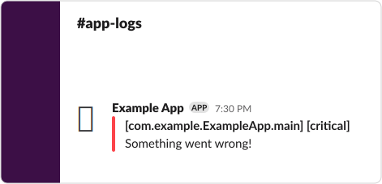

# LoggingHttp


Welcome to **LoggingHttp** – a logging backend for [SwiftLog](https://github.com/apple/swift-log) that sends critical log messages over HTTP.

## Usage

### Bootstrap SwiftLog
LoggingHttp is intended to be used as a secondary logging backend to send log messages directly to a web server.

You can use SwiftLog's `MultiplexLogHandler` to setup LoggingHttp with another logging backend.

```swift
import Logging
import LoggingHttp

let url = URL(string: "https://localhost:8080")!

LoggingSystem.bootstrap { label in
    MultiplexLogHandler([
        // Setup HttpLogHandler with a URL 
        HttpLogHandler(label: label, url: URL),
        // Setup the standard logging backend to enable console logging
        StreamLogHandler.standardOutput(label: label)
    ])
}
```

### Using a Logger

You can now use SwiftLog as usual and log messages are sent to a web server.

```swift
import Logging

let logger = Logger(label: "com.example.ExampleApp.main")

logger.info("Some info we want to log")
```

### Logger Output

The logger will output an HTTP payload and a console message since both logging backends were setup.



```plain
2020-02-15T19:30:00-0800 info: Some info we want to log
```

### Log Level Threshold

You can adjust the log level threshold by changing the `globalLogLevelThreshold` static property on `HttpLogHandler`.

For example, this will configure LoggingHttp to send all `error` log level and above messages .

```swift
HttpLogHandler.globalLogLevelThreshold = .error
```

## Installation

LoggingHttp requires Xcode 11 or a Swift 5.1 toolchain with the Swift Package Manager. 

### Swift Package Manager

Add the LoggingHttp package as a dependency to your `Package.swift` file.

```swift
.package(url: "https://github.com/HeartedApp/SwiftLogHttp.git", from: "1.0.0")
```

Add LoggingHttp to your target's dependencies.

```swift
.target(name: "Example", dependencies: ["LoggingHttp"])
```
